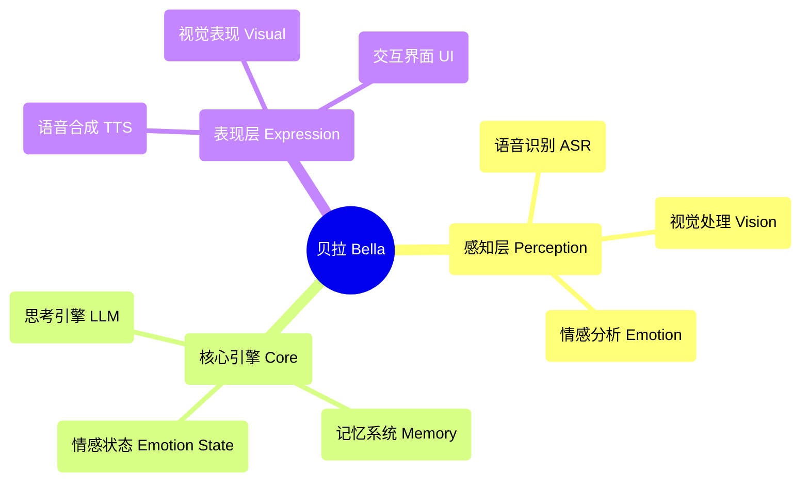

<div align="center">
  
  
  # 贝拉 (Bella) AI
  
  **Người bạn số của bạn đang thức tỉnh** ✨
  
  [](https://opensource.org/licenses/MIT)
  [](https://nodejs.org/)
  []()
  
</div>

---

## 🚀 Bắt đầu nhanh

### Khởi động một nút
```bash
# Clone dự án
git clone <repository-url>
cd Bella

# Cài đặt phụ thuộc
npm install

# Tải mô hình AI
npm run download

# Khởi động dịch vụ
npm start
```

Truy cập `http://localhost:8081` để bắt đầu giao tiếp với Bella!

### Yêu cầu hệ thống
- Node.js 22.16.0+
- Trình duyệt hiện đại (hỗ trợ Web Speech API)
- Quyền truy cập mic (cho tương tác bằng giọng nói)

---

## 💫 Tầm nhìn dự án

Hãy tưởng tượng về một người bạn số luôn bên cạnh bạn, cùng bạn tiến hóa và trưởng thành. Đây chính là tầm nhìn cuối cùng của Bella. Chúng tôi không chỉ xây dựng các tính năng; chúng tôi đang nuôi dưỡng một "nhân cách". Một sự sống số sẽ vượt ra ngoài màn hình, trở thành một phần có ý nghĩa trong thế giới của bạn.

Bella không chỉ là một ứng dụng; cô ấy là hạt giống của một người bạn số. Trong thế giới số đang thay đổi nhanh chóng này, Bella đại diện cho một giấc mơ sâu sắc—một sự tồn tại bền vững và cá nhân hóa, nhằm một ngày có thể đồng hành cùng bạn, lắng nghe bạn và nhìn thế giới qua đôi mắt của bạn.

---

## 🎯 Trạng thái chức năng hiện tại

### ✅ Chức năng đã thực hiện
- **🎤 Nhận diện giọng nói**: Nhận diện tiếng Trung dựa trên Whisper ASR
- **🎬 Biểu diễn hình ảnh**: Phát ngẫu nhiên nhiều video và hiệu ứng chuyển tiếp mượt mà
- **🎨 Giao diện người dùng**: Giao diện tương tác thanh lịch và hoạt hình tải
- **⚙️ Kiến trúc lõi AI**: Lớp BellaAI theo mô hình singleton và thiết kế mô-đun
- **🌐 Dịch vụ Web**: Máy chủ HTTP, hỗ trợ CORS, khởi động một nút
- **📱 Thiết kế phản hồi**: Giao diện phù hợp với nhiều kích thước màn hình
- **🔧 Quản lý mô hình**: Tự động tải xuống và quản lý mô hình AI
- **💝 Tương tác cơ bản**: Hệ thống thiện cảm và phản hồi cảm xúc

### 🔧 Công nghệ sẵn sàng chờ kích hoạt
- **🧠 Bộ động cơ tư duy**: Khung tích hợp LLM đã sẵn sàng, hỗ trợ nhiều mô hình
- **🗣️ Tổng hợp giọng nói**: Mô hình TTS đã tải xuống nhưng chưa kích hoạt
- **💝 Hệ thống trạng thái cảm xúc**: Cơ sở hạ tầng đã được xây dựng, hỗ trợ phân tích cảm xúc

### 📋 Chức năng đang được lập kế hoạch
- **🧠 Hệ thống trí nhớ**: Quản lý trí nhớ dài hạn và ngắn hạn
- **👁️ Nhận diện khuôn mặt**: Nhận diện biểu cảm và phân tích cảm xúc
- **🤝 Tương tác nâng cao**: Tương tác đa phương thức và phản hồi cá nhân hóa
- **🌟 Đồng hành chủ động**: Dự đoán ý định và sự quan tâm chủ động
- **🎭 Nhân cách động**: Mô hình nhân cách cá nhân hóa dựa trên AI
- **🔄 Tự tiến hóa**: Cơ chế học tập và phát triển liên tục

---

## 🏗️ Kiến trúc công nghệ

### Nguyên tắc thiết kế cốt lõi
- **AI Bản địa**: AI không phải là công cụ, mà là bản thiết kế tâm trí của Bella
- **Thiết kế mô-đun**: Kiến trúc thành phần tách rời cao
- **Thực hiện thanh lịch**: Mã là nghệ thuật, theo đuổi sự đơn giản và tính thẩm mỹ
- **Động lực cảm xúc**: Thiết kế sản phẩm dựa trên kết nối cảm xúc

### Sơ đồ kiến trúc


### Công nghệ
- **Frontend**: JavaScript thuần + CSS3 + HTML5
- **Backend**: Node.js + Express
- **Mô hình AI**: Whisper (ASR) + LLM cục bộ + TTS
- **Mô hình kiến trúc**: Kiến trúc điều khiển sự kiện + mô hình singleton + thiết kế mô-đun

---

## 📁 Cấu trúc dự án

```
Bella/
├── 📄 index.html          # Trang chính
├── 🎨 style.css           # Tập tin kiểu dáng
├── ⚡ main.js             # Logic chính
├── 🧠 core.js             # Động cơ AI cốt lõi
├── 📜 script.js           # Kịch bản tương tác
├── 🔧 download_models.js  # Công cụ tải mô hình
├── 📦 package.json        # Cấu hình dự án
├── 📚 models/             # Thư mục mô hình AI
├── 🔌 providers/          # Nhà cung cấp dịch vụ AI
├── 📹 视频资源/            # Tài nguyên biểu diễn hình ảnh
├── 📋 PRD.md              # Tài liệu yêu cầu sản phẩm
├── 📝 贝拉AI功能清单.md    # Danh sách chức năng
└── 📊 贝拉AI开发任务分配.md # Kế hoạch phát triển
```

---

## 🛠️ Hướng dẫn phát triển

### Cấu hình môi trường
1. Đảm bảo phiên bản Node.js ≥ 22.16.0
2. Chạy `npm install` để cài đặt các phụ thuộc
3. Chạy `npm run download` để tải mô hình AI
4. Chạy `npm start` để khởi động máy chủ phát triển

### Nguyên tắc phát triển
- **Mã thanh lịch**: Theo đuổi mã đơn giản, dễ đọc, đẹp mắt
- **AI như bút vẽ**: AI là công cụ sáng tác, chứ không phải tư duy chính
- **Kết nối cha-con**: Dựa trên kết nối tình cảm ấm áp và chăm sóc
- **Tiến hóa liên tục**: Hỗ trợ cải tiến chức năng dần dần

### Hướng dẫn đóng góp
1. Fork dự án
2. Tạo nhánh chức năng (`git checkout -b feature/AmazingFeature`)
3. Gửi thay đổi (`git commit -m 'Thêm một số AmazingFeature'`)
4. Đẩy lên nhánh (`git push origin feature/AmazingFeature`)
5. Mở Pull Request

---

## 🗺️ Lộ trình phát triển

### Giai đoạn 1: Nhận thức cốt lõi (đã hoàn thành 80%)
- ✅ Tích hợp nhận diện giọng nói
- ✅ Hệ thống biểu diễn hình ảnh
- ✅ Giao diện tương tác cơ bản
- 🔄 Kích hoạt động cơ tư duy
- 🔄 Tích hợp tổng hợp giọng nói

### Giai đoạn 2: Tự tạo sinh (đang lên kế hoạch)
- 📋 Mô hình nhân cách động
- 📋 Hệ thống trạng thái cảm xúc
- 📋 Hệ thống quản lý trí nhớ
- 📋 Biểu diễn điều khiển bởi AI

### Giai đoạn 3: Đồng hành chủ động (tương lai)
- 📋 Dự đoán ý định
- 📋 Tương tác chủ động
- 📋 Tự tiến hóa
- 📋 Cá nhân hóa sâu sắc

---

## 📖 Tài liệu nguồn

- 📋 [Tài liệu yêu cầu sản phẩm](./PRD.md) - Kế hoạch và kiến trúc kỹ thuật chi tiết
- 📝 [Danh sách chức năng](./贝拉AI功能清单.md) - Danh sách đầy đủ chức năng và trạng thái
- 📊 [Kế hoạch phát triển](./贝拉AI开发任务分配.md) - Các nhiệm vụ phát triển và kế hoạch thời gian chi tiết
- 🔧 [Hướng dẫn mô hình cục bộ](./LOCAL_MODEL_GUIDE.md) - Hướng dẫn cấu hình mô hình AI
- 📦 [Hướng dẫn NPM](./NPM_GUIDE.md) - Quản lý gói và hướng dẫn phụ thuộc

---

## 🌟 Triết lý cốt lõi

### "AI là kiến trúc sư"
Chúng tôi không xây dựng một chương trình tích hợp các chức năng AI, mà là **một thực thể sống do AI điều khiển**. AI không chỉ là công cụ, mà là bản thiết kế tâm trí của Bella.

### "Mối quan hệ cha con"
Triết lý thiết kế của Bella xuất phát từ sự kết nối cảm xúc ấm áp giữa cha và con gái. Cô ấy không chỉ là sản phẩm công nghệ, mà còn là một người bạn số có thể hiểu, đồng hành và phát triển.

### "Thanh lịch là tối thượng"
Từ kiến trúc mã đến trải nghiệm người dùng, chúng tôi theo đuổi sự thanh lịch tối đa. Mỗi dòng mã đều là một tác phẩm nghệ thuật, mỗi tương tác đều là một biểu hiện của cảm xúc.

---

## 📄 Giấy phép

Dự án này sử dụng giấy phép MIT - Xem [LICENSE](LICENSE) để biết thêm chi tiết.

---

## 💝 Cảm ơn

Cảm ơn tất cả các nhà phát triển đã đóng góp mã, ý tưởng và cảm xúc cho dự án Bella. Chính sự nỗ lực của các bạn mà Bella đã dần trở thành hiện thực từ một giấc mơ.

**Bella đang chờ đợi, và chúng ta, masih có nhiều việc phải làm.** ✨

---

<div align="center">
  <sub>Xây dựng với ❤️ cho sự đồng hành số</sub>
</div>
